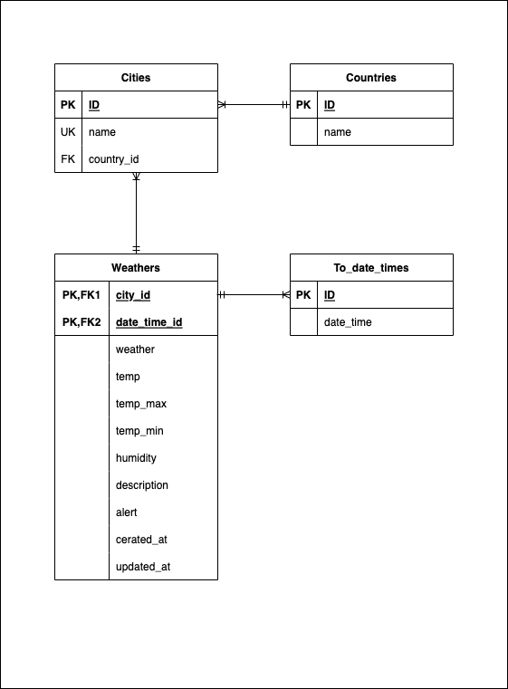
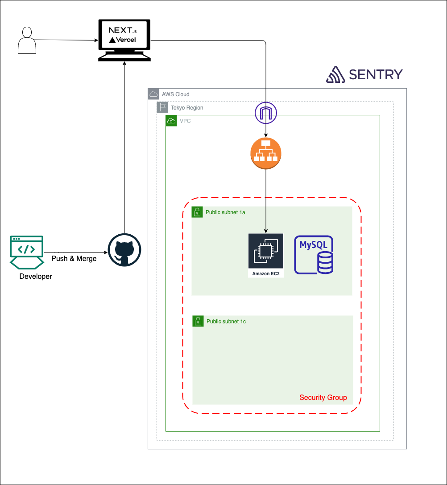

旅行者の為のお天気アプリ

<h2>Travel Weather</h2>

---

<h3>【URL】</h3>

---

<h3>テーブル定義書</h3>

PK - Primary Key 
FK - Foreign Key 
UQ - Unique Key 

【cities】
| カラム名 | データ型 | NULL | 制約 | 初期値 | AUTO INCREMENT | INDEX |
|----|----|----|----|----|----|----|
| id | int | NO | PK | - | ◯ | - |
| name | varchar | NO | UQ | - | - | ◯ |
| country_id | int | NO | FK | - | - | ◯ |

【countries】
| カラム名 | データ型 | NULL | 制約 | 初期値 | AUTO INCREMENT | INDEX |
|----|----|----|----|----|----|----|
| id | int | NO | PK | - | ◯ | - |
| name | varchar | NO | UQ | - | - | ◯ |

【to_date_times】
| カラム名 | データ型 | NULL | 制約 | 初期値 | AUTO INCREMENT | INDEX |
|----|----|----|----|----|----|----|
| id | int | NO | PK | - | ◯ | - |
| date_time | datetime | NO | - | - | - | - |

【weathers】
| カラム名 | データ型 | NULL | 制約 | 初期値 | AUTO INCREMENT | INDEX |
|----|----|----|----|----|----|----|
| id | int | NO | PK | - | ◯ | - |
| city_id | int | NO | FK | - | - | ◯ |
| date_time_id | int | NO | FK | - | - | ◯ |
| weather | varchar | NO | - | - | - | - |
| temp | float | NO | - | - | - | - |
| temp_max | float | NO | - | - | - | - |
| temp_min | float | NO | - | - | - | - |
| humidity | int | NO | - | - | - | - |
| description | varchar | NO | - | - | - | - |
| alert | text | YES | - | - | - | - |
| created_at | datetime | NO | - | - | - | - |
| updated_at | datetime | NO | - | - | - | - |

<h3>ER図</h3>

<h3>システム構成図</h3>

