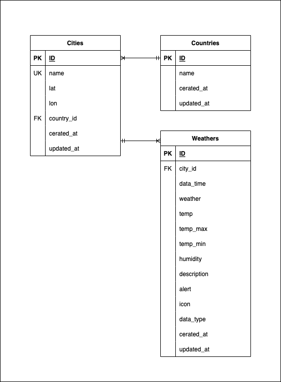

旅行者の為のお天気アプリ

<h2>Travel Weather</h2>

市区町村を入力してボタンを押下（またはEnter）する事で、その市区町村の天気を取得して表示します。 
同じ市区町村で、同じ時間帯の天気をすでに取得されている場合、DBから取得します。 
表示するのは現在、3時間後、6時間後、12時間後の天気と、明日から5日後までの天気です。 
毎時0分を過ぎたあとの最初の取得は、APIから情報を取得して最新の情報を表示します。 
また、明日から5日後の天気については、最終取得時間より12時間が経過していた場合、APIから最新の情報を取得します。 

使用外部API：<a href="https://openweathermap.org/" target="_blank" rel="noopener">Open Weather Map API</a>

---

<h3>【URL】<a href="https://www.yto-weather.com" target="_blank" rel="noopener">Travel Weather</a></h3>

---

<h3>テーブル定義書</h3>

PK - Primary Key 
FK - Foreign Key 
UQ - Unique Key 

【cities】
| カラム名 | データ型 | NULL | 制約 | 初期値 | AUTO INCREMENT | INDEX |
|----|----|----|----|----|----|----|
| id | int | NO | PK | - | ◯ | - |
| name | string | NO | UQ | - | - | ◯ |
| lat | string | NO | - | - | - | ◯ |
| lon | string | NO | - | - | - | ◯ |
| country_id | int | NO | FK | - | - | - |
| created_at | datetime | NO | - | - | - | - |
| updated_at | datetime | NO | - | - | - | - |

【countries】
| カラム名 | データ型 | NULL | 制約 | 初期値 | AUTO INCREMENT | INDEX |
|----|----|----|----|----|----|----|
| id | int | NO | PK | - | ◯ | - |
| name | string | NO | UQ | - | - | ◯ |
| created_at | datetime | NO | - | - | - | - |
| updated_at | datetime | NO | - | - | - | - |

【weathers】
| カラム名 | データ型 | NULL | 制約 | 初期値 | AUTO INCREMENT | INDEX |
|----|----|----|----|----|----|----|
| id | int | NO | PK | - | ◯ | - |
| city_id | int | NO | FK | - | - | ◯ |
| date_time | datetime | NO | - | - | - | ◯ |
| weather | string | NO | - | - | - | - |
| temp | float | NO | - | - | - | - |
| temp_max | float | NO | - | - | - | - |
| temp_min | float | NO | - | - | - | - |
| humidity | int | NO | - | - | - | - |
| description | string | NO | - | - | - | - |
| alert | text | YES | - | - | - | - |
| icon | string | NO | - | - | - | - |
| data_type | string | NO | - | - | - | ◯ |
| created_at | datetime | NO | - | - | - | - |
| updated_at | datetime | NO | - | - | - | - |

<h3>ER図</h3>

<h3>システム構成図</h3>

